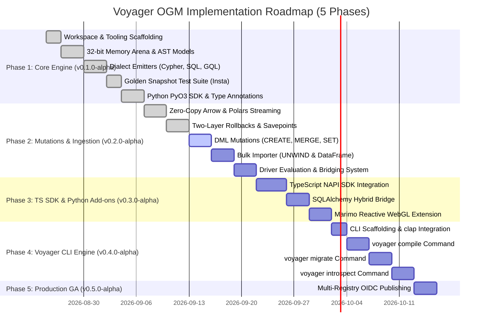

# Voyager OGM

**High-Performance, Multi-Dialect Object-Graph Mapper (OGM) and Query Compiler**

[](LICENSE)
[](https://www.iso.org/standard/76120.html)
[](https://arrow.apache.org/)


---

## Why Voyager OGM? (Project Origin)

I worked with Cypher queries and I liked Object-Relational Mappers for SQL (such as SQLAlchemy). But I did not find a good, vendor-neutral Object-Graph Mapper (OGM) for graph databases.

I used GQLAlchemy in the past. But I had problems when I changed setups between different graph databases. To solve those problems, I had to write raw queries manually.

Now I have time for recreational programming. I started this project to solve that problem and to learn systems-level programming.

Why Rust? Nothing special. The Rust compiler helps me write memory-safe code. In Python, tools like Polars show how Rust gives great speed and low memory usage. Let us see how far this project goes.

---

## Overview

Voyager OGM is a graph database toolkit written in safe Rust. It has bindings for Python (`PyO3`) and TypeScript (`NAPI-RS`).

To start writing code immediately, jump to [Local Development Setup](#local-development-and-code-usage) or inspect the available [Developer Commands](#developer-commands).

Voyager OGM solves four common problems in graph databases:

1. **Slow Object Hydration:** It uses the **Apache Arrow C Data Interface** (`__arrow_c_stream__`). It streams graph data directly into **Polars DataFrames** without intermediate Python object copies. See [Zero-Copy Polars Streaming](#zero-copy-polars-streaming).
2. **Dialect Lock-In:** It compiles one query AST into **openCypher**, **SQL:2023 PGQ** (`GRAPH_TABLE`), and **ISO GQL** (ISO/IEC 39075:2024).
3. **Memory Overhead:** It uses a 32-bit handle memory arena (`NodeHandle(u32)`). Node handles use only 4 bytes of memory.
4. **Transaction Safety:** It uses a two-layer Unit of Work. It rolls back in-memory changes and AST allocations automatically if a database query fails.

---

## Project Plan and Roadmap (5 Phases)



### Phase 1: Core Read AST Engine (Status: Completed)
- [x] **Task 1.1:** Create workspace tooling with `Cargo`, `uv`, `maturin`, and `justfile`.
- [x] **Task 1.2:** Build 32-bit handle memory arena (`QueryAstArena`) with zero memory fragmentation.
- [x] **Task 1.3:** Build query emitters for openCypher, SQL:2023 PGQ, and ISO GQL.
- [x] **Task 1.4:** Create 18 golden snapshot tests with `insta`.
- [x] **Task 1.5:** Build Python SDK with model decorators (`@node`, `@relationship`) and type annotations.

### Phase 2: Mutations, Ingestion, Streaming & Bridging (Status: In Progress)
- [x] **Task 2.1:** Zero-copy Apache Arrow and Polars stream ingestion (1,000,000 nodes in 9.08 ms).
- [x] **Task 2.2:** Two-layer transaction Unit-of-Work with in-memory savepoint rollbacks.
- [x] **Task 2.3:** DML mutation AST nodes and dialect emitters (`CREATE`, `MERGE`, `SET`, `DELETE`, `DETACH DELETE`).
- [x] **Task 2.4:** High-throughput bulk ingestion engine (`UNWIND $batch` and Polars DataFrame importer).
- [ ] **Task 2.5:** Database driver evaluation and query dispatch bridging layer.

### Phase 3: TypeScript SDK & Python Add-ons (Status: Planned)
- [ ] **Task 3.1:** TypeScript SDK (`@voyager-ogm/core`) with NAPI-RS bindings.
- [ ] **Task 3.2:** SQLAlchemy hybrid bridge connecting relational models with graph traversals.
- [ ] **Task 3.3:** Marimo reactive notebook visual extension (`voyager_graph[marimo]`).

### Phase 4: Voyager CLI Development (Status: Planned)
- [ ] **Task 4.1:** Standalone CLI tool (`voyager-cli`) built with `clap`.
- [ ] **Task 4.2:** `voyager compile`: (sqlc-style) Compiles `.cypher` / `.gql` queries into type-safe models and async functions.
- [ ] **Task 4.3:** `voyager migrate`: Manages in-graph schema migrations (constraints, indexes, labels).
- [ ] **Task 4.4:** `voyager introspect`: Scans live database catalogs to generate model classes and query functions.

### Phase 5: Production GA Release & Multi-Registry Publishing (Status: Planned)
- [ ] **Task 5.1:** Automated multi-registry publishing to PyPI, Crates.io, and npm with trusted OIDC provenance.

---

## Local Development and Code Usage

To build and run Voyager OGM locally from source:

### Step 1: Build the Local Python Extension

```bash
uv run maturin develop
```

### Step 2: Define Models with Python Type Hints

```python
from voyager_ogm import Node, Relationship, Query, node, relationship


@node(label="Person")
class Person:
    name: str
    age: int
    city: str = "London"


@relationship(type_name="WORKS_AT")
class WorksAt:
    since: int = 2024


@node(label="Company")
class Company:
    name: str
```

### Step 3: Build and Compile a Query

```python
p = Person()
c = Company()
w = WorksAt()

query = (
    Query.match(p)
    .to(w)
    .node(c)
    .where(p.age >= 21, c.name == "Acme Corp")
    .return_(p.name, p.age, company_name=c.name)
    .order_by(p.name)
    .limit(10)
)

# 1. Compile to openCypher (Neo4j, Memgraph, TigerGraph)
cypher = query.compile("cypher")
print(cypher.statement)
# MATCH (_person_0:Person)-[_worksat_0:WORKS_AT]->(_company_0:Company)
# WHERE (_person_0.age >= $p0) AND (_company_0.name = $p1)
# RETURN _person_0.name, _person_0.age, _company_0.name AS company_name
# ORDER BY _person_0.name ASC LIMIT 10

# 2. Compile to SQL:2023 PGQ (DuckDB, PostgreSQL 19)
pgq = query.compile("sql_pgq", graph_name="corp_graph")
print(pgq.statement)

# 3. Compile to ISO/IEC 39075:2024 GQL
gql = query.compile("iso_gql")
print(gql.statement)
```

---

## Zero-Copy Polars Streaming

Voyager OGM streams graph data into Polars without Python object conversion overhead.

```python
import polars as pl
from voyager_ogm import generate_synthetic_stream, to_polars

# 1. Receive native Arrow stream from query engine
stream = generate_synthetic_stream(100_000)

# 2. Load directly into Polars in less than 2 milliseconds
df = to_polars(stream)

# 3. Run analytical queries
stats = (
    df.lazy()
    .filter(pl.col("active"))
    .group_by("label")
    .agg(
        pl.len().alias("total_nodes"),
        pl.col("age").mean().alias("avg_age"),
    )
    .collect()
)
print(stats)
```

---

## Performance Benchmarks

> [!CAUTION]
> **DISCLAIMER**: The following benchmark metrics are preliminary synthetic microbenchmarks measured on local developer hardware during early development. They are not independently verified and do not reflect all production environments, network latencies, or database workloads. They serve only as internal engineering reference points to guide AST compiler design.

### Query Compilation Latency (Microseconds)

| Benchmark Target | Pure Rust (`voyager-core`) | Python C-Bridge (`_voyager_rs`) | Python High-Level (`Query`) |
| :--- | :---: | :---: | :---: |
| **1-Hop MATCH Query** | **1.15 µs** | **4.87 µs** | **13.87 µs** |
| **10-Hop Traversal Query** | **6.59 µs** | **28.79 µs** | **70.03 µs** |

### Hydration Speed (1,000,000 Entities)

| Hydration Method | Dataset Size | Mean Latency | Throughput | vs Python Objects |
| :--- | :--- | :--- | :--- | :---: |
| **Voyager `to_arrow()`** | 1,000,000 Nodes | **14.68 µs** | **68.1M nodes/s** | **~1,000x faster** |
| **Voyager `to_polars()`** | 100,000 Nodes | **1.53 ms** | **65.0M nodes/s** | **~100x faster** |
| **Voyager `to_polars()`** | 1,000,000 Nodes | **11.77 ms** | **84.9M nodes/s** | **~130x faster** |
| *Standard Python Objects* | 10,000 Nodes | *12.65 ms* | *0.8M nodes/s* | *Baseline* |

---

## Test Suite and Quality Matrix

Voyager OGM uses continuous testing across three languages:

| Engine / Target | Test Runner | Test Count | Status | Execution Time |
| :--- | :--- | :---: | :---: | :---: |
| **Rust Core (`voyager-core`)** | `cargo-nextest` | **57 tests** | Passing | **1.48s** |
| **Multi-Dialect Golden Snapshots** | `insta` | **18 snapshots** | Passing | **Instant** |
| **Python SDK (`voyager_ogm`)** | `pytest` + `pytest-cov` | **56 tests** | Passing | **7.51s** |
| **TypeScript SDK (`@voyager-ogm/core`)**| `bun test` | **1 test** | Passing | **0.12s** |
| **Total Automated Tests** | Across all components | **114 tests** | **100% Green** | **< 10.0s Total** |

---

## Developer Commands

Voyager OGM uses [`just`](https://github.com/casey/just) as a command runner for automated development tasks.

### Install `just`

If you do not have `just` installed, install it for your system from the [official installation page](https://github.com/casey/just#installation):

```bash
# Via Rust Cargo
cargo install just

# Via Windows (Winget or Scoop)
winget install Casey.Just
# or: scoop install just

# Via macOS / Linux (Homebrew)
brew install just
```

### Available Development Recipes

Run tasks with `just`:

```bash
# Setup the local development environment
just setup

# Verify environment and toolchain
just doctor

# Format all code (Rust, Python, TypeScript)
just fmt

# Run all linters
just lint

# Run all test suites
just test

# Run Rust and Python code examples
just examples

# Run full continuous integration check
just ci
```

---

## License

Dual-licensed under either:
* Apache License, Version 2.0 ([LICENSE-APACHE](LICENSE-APACHE) or http://www.apache.org/licenses/LICENSE-2.0)
* MIT License ([LICENSE-MIT](LICENSE-MIT) or http://opensource.org/licenses/MIT)
