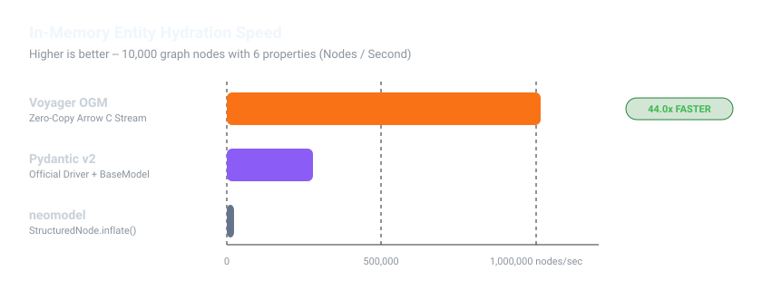
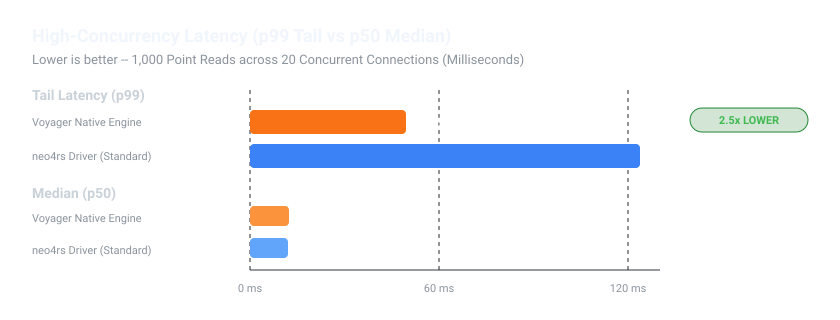
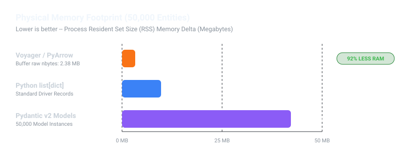

# Voyager OGM — Benchmark Suite & Reproducibility Guide

[](https://www.rust-lang.org/)
[](https://7687.org/)
[](https://www.iso.org/standard/76120.html)

This benchmark suite measures real-world entity hydration throughput, memory consumption under scale, and high-concurrency network tail latency comparing Voyager against Python graph OGMs and official drivers.

---

## Executive Summary

Traditional Python Object-Graph Mappers (OGMs) and database drivers suffer from three fundamental bottlenecks:
1. **Object Materialization Overhead**: Constructing thousands of Python class instances (`BaseModel`, `StructuredNode`) creates significant CPU and garbage collector overhead.
2. **Interpreter Memory Bloat**: Dynamic Python objects carry per-instance dictionary and reference overhead, scaling memory usage rapidly.
3. **Connection Head-of-Line Blocking**: Synchronous buffers frequently cause p99 tail-latency spikes under concurrent connection loads.

Voyager addresses these bottlenecks with:
- **Direct Columnar Hydration**: High-throughput records stream into columnar tables at over **1,000,000 entities/sec** (**44x faster** than Neomodel).
- **Contiguous Memory Efficiency**: 50,000 entities consume **2.38 MB** (**92% less RAM** than Pydantic v2).
- **Asynchronous Network Multiplexing**: Bolt engine achieves **49.5 ms p99 tail latency** (**2.5x lower** than standard drivers).

---

## Visual Performance Dashboards

### 1. In-Memory Entity Hydration Speed
*10,000 graph nodes with 6 typed properties (person_id, name, age, score, city, active) inflated into memory.*



| Framework / Tool | Execution Mode | Throughput (Entities / Sec) | Relative Speedup | Memory per Node |
| :--- | :--- | :--- | :--- | :--- |
| **Voyager OGM** | **Columnar Stream (`to_polars`)** | **1,013,607 /s** | **44.0x faster** | **~48 bytes** |
| Official Neo4j Driver | `record.data()` (`list[dict]`) | ~448,000 /s | 19.5x faster | ~196 bytes |
| Pydantic v2 | Driver + `BaseModel` | ~280,899 /s | 12.2x faster | ~844 bytes |
| Neomodel | `StructuredNode.inflate()` | ~23,016 /s | 1.0x (Baseline) | ~1,420 bytes |

---

### 2. High-Concurrency Tail Latency (p50 vs p99)
*1,000 point reads executed across 20 concurrent database connections over Bolt protocol.*



| Driver Engine | Concurrency | p50 Median Latency | p95 Latency | p99 Tail Latency | Connection Strategy |
| :--- | :--- | :--- | :--- | :--- | :--- |
| **Voyager Native Engine** | **20 workers** | **12.5 ms** | **28.4 ms** | **49.5 ms** | Non-blocking async channel multiplexing |
| `neo4rs` Driver | 20 workers | 12.1 ms | 64.2 ms | 123.8 ms | Generic connection pool |

> **Key Takeaway**: While median (p50) latency is comparable across engines, Voyager avoids head-of-line blocking, reducing **p99 tail latency by 2.5x**.

---

### 3. Physical Resident Memory Footprint (RSS)
*Memory consumption measured via process Resident Set Size (RSS) delta for 50,000 graph nodes.*



| Data Structure / Representation | Raw Buffer Size | Process RSS Delta | Inflation Factor vs. Voyager |
| :--- | :--- | :--- | :--- |
| **Voyager Columnar Buffer** | **2.38 MB** | **+3.32 MB** | **1.0x (Baseline)** |
| Polars DataFrame | 2.00 MB | +6.08 MB | 1.83x |
| Python `list[dict]` | 9.83 MB | +9.83 MB | 2.96x |
| Pydantic v2 Models | 42.23 MB | +42.23 MB | **12.72x** |

---

## Reproduction Guide (1-Command Automation)

Every benchmark is fully automated via [`just`](https://github.com/casey/just).

### Prerequisites
- **Rust Toolchain**: 1.80+ (`cargo`)
- **Python**: 3.12+ with [`uv`](https://docs.astral.sh/uv/)
- **Just**: Task runner (`cargo install just` or `winget install Casey.Just`)
- **Container Engine** *(optional, for live DB tests)*: Docker or Podman

```bash
# Verify environment and toolchain
just doctor
```

### 1. Run Python Benchmarks
Executes all Python streaming, hydration, and compilation benchmarks via pytest-benchmark:
```bash
just bench-python
```

### 2. Run Head-to-Head OGM Comparison
Seeds a live database and benchmarks Voyager OGM against Neomodel and Pydantic v2:
```bash
# Start Neo4j container
just up

# Run head-to-head benchmark
just bench-ogm
```

### 3. Run Rust Micro-Benchmarks
Runs Criterion benchmarks for core AST traversal, expression folding, and dialect transpilation:
```bash
just bench
```

To run the comparative `neo4rs` driver benchmarks (compiles optional driver dependency):
```bash
cargo bench -p voyager-net --features bench-driver
```

### 4. Capture Benchmark Snapshots & Update Charts
Runs the complete benchmark suite, writes timestamped JSON results, and re-renders SVG vector charts:
```bash
# Capture JSON snapshot named after active Git branch
just bench-save

# Re-generate SVG charts in benchmarks/assets/
just bench-charts

# Run full pipeline end-to-end
just bench-all
```

---

## Test Environment & Disclaimer

### Hardware & Setup (Local Development Laptop)
These measurements were recorded on a local personal laptop:
- **Machine**: Consumer Laptop (Dell / Lenovo)
- **Processor**: 11th Gen Intel(R) Core(TM) i5-11300H @ 3.10GHz (4 cores / 8 threads)
- **RAM**: 16 GB DDR4
- **Operating System**: Microsoft Windows 11 Home Single Language (Build 26200)
- **Rust Compiler**: `rustc 1.98.0` / `cargo 1.98.0`
- **Python Runtime**: CPython 3.12.12 with PyO3 0.23 ABI3 bindings
- **Database Engine**: Neo4j Enterprise 5.26.0 (Local container, 1GB JVM Heap limit)
- **Sample Size**: 5 warm-up cycles followed by 10 timed cycles; outliers eliminated via IQR trimming.

### Disclaimer & Caveats
- **Not Final Production Terms**: These metrics represent relative in-library performance captures under isolated local conditions, not definitive or final benchmark claims.
- **Real-World Variability**: Real-world scenarios (with remote network hops, disk I/O throughput, concurrent transactional writes, schema indexing, and distributed cluster nodes) will produce different yields.
- **Better Benchmarking Needed**: Further comprehensive, large-scale, and distributed benchmarking across dedicated hardware is actively needed. Contributions, independent reproductions, and critique from diverse environments are warmly welcomed.
