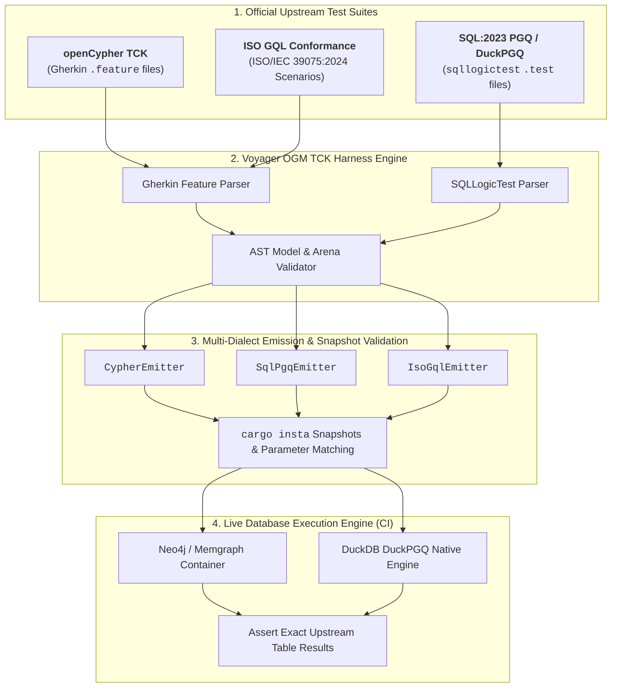

# Voyager OGM: Multi-Dialect TCK Conformance Harness

This document outlines how Voyager OGM systematically verifies query compilation correctness across **openCypher**, **SQL:2023 PGQ**, **ISO GQL**, and **DuckPGQ** by directly utilizing official upstream test suites.

---

## 🎯 Verification Architecture

---

## 🛡️ 3-Stage Correctness Verification Pipeline

### Stage 1: Syntax & Semantic Normalization
* The harness parses the official query string and background graph setup from the `.feature` and `.test` files.
* The test runner compiles the query via Voyager OGM's `QueryAstArena` and ensures all clauses (`MATCH`, `WHERE`, `RETURN`, `ORDER BY`, `LIMIT`) are correctly constructed.

### Stage 2: Byte-for-Byte Snapshot Verification (`cargo insta`)
* For every official TCK scenario, Voyager OGM emits:
  1. Parameterized Dialect Query String (e.g. `$p0, $p1` for Cypher/GQL, `:p0, :p1` for SQL:2023 PGQ).
  2. Extracted `ParameterMap` containing extracted literals.
* Snapshots are compared against golden baselines to ensure zero dialect regressions.

### Stage 3: Live Upstream Result Validation
* In CI, the emitted query and parameters are executed against:
  - **Neo4j / Memgraph** for openCypher scenarios.
  - **DuckDB + DuckPGQ** for SQL:2023 PGQ scenarios.
* The resulting tabular output is compared against the official `Then the result should be:` table.

---

## 📋 Dialect Support Matrix

| Clause / Feature | openCypher TCK | SQL:2023 PGQ | ISO GQL (2024) | DuckPGQ |
| :--- | :--- | :--- | :--- | :--- |
| **Node Filtering (`WHERE`)** | ✅ `(p:Person WHERE p.age > 21)` | ✅ `(p:Person WHERE p.age > 21)` | ✅ `(p:Person WHERE p.age > 21)` | ✅ Inlined in `MATCH` |
| **Edge Traversal** | ✅ `(a)-[:KNOWS]->(b)` | ✅ `(a) -[:knows]-> (b)` | ✅ `(a) -[:KNOWS]-> (b)` | ✅ `(a) -[k:knows]-> (b)` |
| **Variable Hops** | ✅ `[:KNOWS*1..3]` | ✅ `-[k:knows]->{1,3}` | ✅ `-[k:KNOWS]->{1,3}` | ✅ `-[k:knows]->{1,3}` |
| **Undirected Edges** | ✅ `(a)-[:KNOWS]-(b)` | ✅ `(a) -[:knows]- (b)` | ✅ `(a) ~[:KNOWS]~ (b)` | ✅ `(a) -[:knows]- (b)` |
| **Aggregations** | ✅ `count(p), avg(p.age)` | ✅ `COUNT(p.id), AVG(p.age)` | ✅ `count(p), avg(p.age)` | ✅ `COUNT(p.id), AVG(...)` |
| **Distinct Projections** | ✅ `RETURN DISTINCT p.name` | ✅ `SELECT DISTINCT gt.name` | ✅ `RETURN DISTINCT p.name` | ✅ `SELECT DISTINCT ...` |
| **Pagination** | ✅ `SKIP 10 LIMIT 5` | ✅ `OFFSET 10 ROWS FETCH NEXT 5 ROWS` / `LIMIT 5 OFFSET 10` | ✅ `OFFSET 10 LIMIT 5` | ✅ `LIMIT 5 OFFSET 10` |
